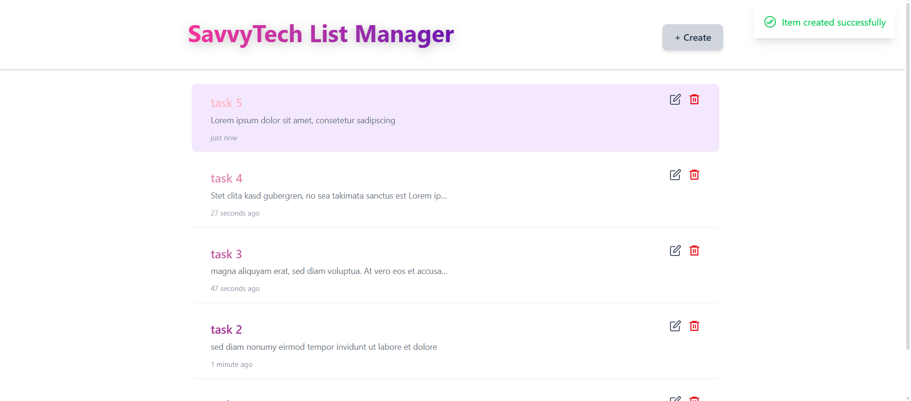

# 🧠 SavvyTech List Manager

A modern and elegant **React + TypeScript** application for managing items efficiently — built as part of a technical task.

---

## 🚀 Features

- ⚡ Add, edit, and delete list items smoothly  
- 🎨 Beautiful gradient UI with **TailwindCSS**  
- 💫 Subtle animations using **Framer Motion**  
- 📱 Fully responsive design  
- 💾 Local state management for simplicity  

---

## 🛠️ Tech Stack

| Technology | Purpose |
|-------------|----------|
| **React + TypeScript** | Core UI framework |
| **TailwindCSS** | Styling and layout |
| **Framer Motion** | Animations |
| **Vite** | Fast bundling and dev server |

---

## 🖼️ Preview

<p align="center">
  
</p>


## 📦 Installation & Setup

Clone the repository and install dependencies:

```bash
git clone https://github.com/panteakheiri60/savvytech-list-manager.git
cd savvytech-list-manager
npm install

